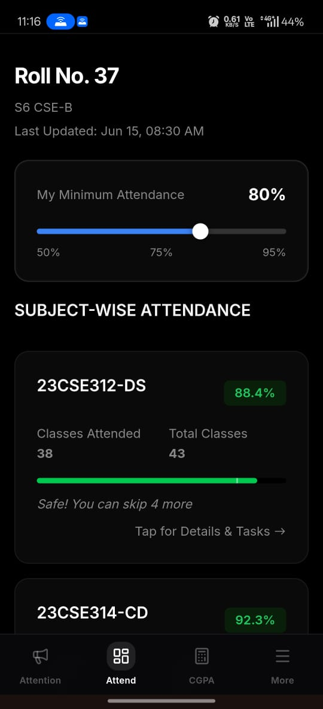
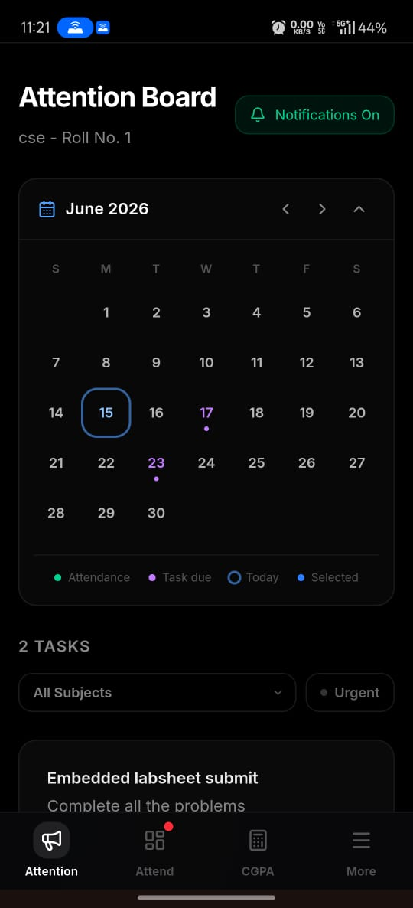
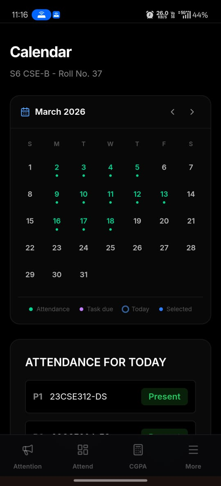

# ShadowMark

> AI-Powered Attendance & Academic Task Management Platform

ShadowMark is a centralized platform designed to solve two major academic challenges faced by students: attendance management and assignment tracking.

By combining AI-powered attendance processing, task management, notifications, and academic analytics into a single platform, ShadowMark helps students stay informed, organized, and academically productive.

### Impact

* 500+ Registered Users
* 200+ Daily Active Users
* 9+ Active Classes
* Reduced attendance shortage cases
* Improved assignment submission rates
* Positive feedback from students and Class Representatives

---

# 🎥 Demo

### Live Website

https://shadowmark.vercel.app/

### 🎥 Demo Video

[Watch Demo Video](https://drive.google.com/file/d/1zgqqntwhLy5jmdYDF6hPlTaEmPk_yJeW/view?usp=drivesdk)

# 📸 Screenshots

### Attendance Dashboard

### Attendance Management

### Announcements & Tasks

### Calendar View

---

# 🔗 Repositories

### Frontend Repository

https://github.com/dilip27m/shadow-frontend

### Backend Repository

https://github.com/dilip27m/shadow-backend

---

# ❗ Problem Statement

Students face two major challenges during their academic journey:

### Attendance Management

* Attendance updates are often delayed.
* Physical attendance registers are still commonly used.
* Students remain unaware of attendance issues until shortages become critical.
* Incorrect attendance markings are difficult to identify and resolve.

### Assignment Tracking

Assignments and announcements are received through multiple channels:

* WhatsApp Groups
* Outlook Emails
* Classroom Announcements
* Department Groups
* Personal Messages

As a result, students frequently miss deadlines, lose track of tasks, and struggle to manage academic responsibilities efficiently.

---

# 💡 Solution

ShadowMark centralizes attendance tracking and academic communication into a single platform.

The system provides:

* AI-powered attendance extraction from classroom attendance sheets.
* Centralized assignment and announcement management.
* Real-time notifications and deadline reminders.
* Attendance analytics and shortage monitoring.
* Calendar-based academic planning.

This eliminates the need to switch between multiple platforms and gives students complete visibility into their academic activities.

---

# 🏗️ System Architecture

## Attendance Workflow

1. Class Representative (CR) uploads a classroom attendance image.
2. Google Gemini AI extracts absent students from the image.
3. Extracted results are displayed for verification.
4. CR reviews and confirms the data.
5. Attendance records are updated for the entire class.

### Benefits

* Faster attendance updates.
* Reduced manual work.
* Improved accuracy.
* Daily attendance visibility.

---

## Assignment & Announcement Workflow

1. CR posts assignments or announcements.
2. Students receive notifications instantly.
3. Tasks become available in a centralized dashboard.
4. Deadlines are tracked through calendar views and reminders.

### Benefits

* Single source of truth for academic tasks.
* Reduced missed deadlines.
* Better academic planning.

---

# ✨ Features

## 👨‍🎓 Student Features

### Attendance Dashboard

* Attendance Percentage Tracking
* Total Classes Conducted
* Total Classes Attended
* Attendance Shortage Monitoring
* Custom Attendance Threshold Slider

### Attendance Calendar

* Day-wise Attendance History
* Attendance Analytics
* Academic Activity Tracking

### Attendance Report System

Students can report incorrect attendance records and request verification from the Class Representative.

### Assignment & Announcement Management

* Real-Time Notifications
* Centralized Task Tracking
* Subject-Wise Filtering
* Urgent Task Sorting
* Deadline Management

### Smart Reminders

Automated reminders before assignment deadlines.

### Skip Impact Calculator

Allows students to analyze how skipping future classes affects attendance percentage.

### CGPA Calculator

Estimate GPA and CGPA using academic performance data.

---

## 👨‍💼 Class Representative (CR) Features

### AI Attendance Upload

* Upload attendance images.
* Review AI-generated attendance data.
* Save attendance records.

### Attendance Management

* Review student reports.
* Update attendance records when required.

### Mistouch Prevention

Attendance records become locked after saving to prevent accidental modifications.

### Student Management

* Restrict visibility for specific users.
* Manage attendance-related access controls.

### Announcement Management

* Post assignments.
* Publish announcements.
* Notify the entire class instantly.

---

## 👑 Super Admin Features

* Monitor multiple classes.
* Manage platform-wide operations.
* Track system activity.
* Oversee attendance and announcements across classes.

---

# 🛠️ Tech Stack

## Frontend

* Next.js
* JavaScript
* Tailwind CSS

## Backend

* Express.js
* MongoDB
* Redis
* JWT Authentication

## AI Integration

* Google Gemini API

## DevOps & Deployment

* Docker
* Vercel (Frontend)
* Render (Backend)

---

# 🔥 Engineering Challenges Solved

### AI-Based Attendance Extraction

Integrated Google Gemini AI to automatically identify absent students from uploaded attendance images, reducing manual effort and improving efficiency.

### Attendance Verification Workflow

Implemented a human verification layer before saving attendance data to reduce errors caused by OCR inaccuracies or unclear images.

### Attendance Dispute Resolution

Built a reporting workflow that allows students to report incorrect attendance records and enables administrators to review and update them.

### Centralized Assignment Tracking

Consolidated assignments and announcements from multiple communication channels into a single platform.

### Performance Optimization

Implemented Redis caching to reduce database load and improve response times for frequently accessed data.

### Secure Authentication & Authorization

Implemented JWT-based authentication and role-based access control to protect academic records and administrative actions.

### Reliable Deployment

Containerized services using Docker and deployed frontend and backend independently for easier maintenance and scalability.

---

# 📊 Results & Impact

ShadowMark is actively used across multiple classes and continues to grow.

### Platform Metrics

* 500+ Registered Users
* 200+ Daily Active Users
* 9+ Active Classes

### Outcomes

✅ Reduced attendance shortage cases.

✅ Improved visibility into attendance records.

✅ Reduced incorrect absent markings.

✅ Improved assignment submission rates.

✅ Centralized academic communication.

✅ Increased student awareness of attendance and academic performance.

---

# 🔮 Future Improvements

### Student Innovation Hub

A platform where students can showcase projects, applications, and achievements.

### Enhanced Authentication

* Institution-level authentication.
* Improved student verification.
* Enhanced account security.

### Academic Resource Repository

Centralized storage for:

* Notes
* Assignments
* Study Materials
* Academic Resources

### Personal Task Manager

Students will be able to manage personal academic goals and tasks alongside classroom assignments.

### Scalability Improvements

Future system enhancements include:

* Event-Driven Architecture
* Queue-Based Processing
* Distributed Caching
* Horizontal Scaling

---

# 👨‍💻 Author

### M. Dilip Kumar Reddy

Passionate about building technology-driven solutions that solve real-world problems and create meaningful impact.

---

⭐ If you found this project interesting, consider giving it a star.

